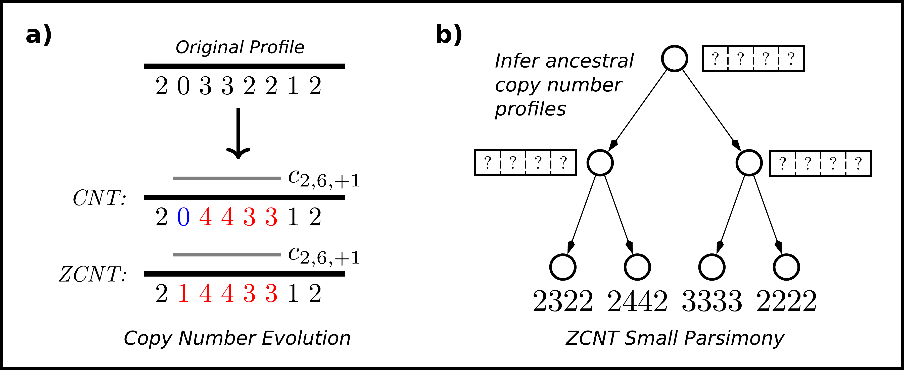

# Lazac: maximum parsimony under the zero-agnostic copy number transformation model

*Lazac* is a tool for inferring single-cell resolution copy number
phylogenies from copy number data. It is based on our *zero-agnostic
copy number transformation* (ZCNT) model, which we recently introduced
as a simplification of the *copy number transformation* (CNT) model.
Our algorithm uses tree search and an efficient solver of the small
parsimony problem to find trees.



If you find this tool useful in your research, please cite us at:
```
@article{schmidt2023zero,
  title={A zero-agnostic model for copy number evolution in cancer},
  author={Schmidt, Henri and Sashittal, Palash and Raphael, Benjamin J},
  journal={bioRxiv},
  pages={2023--04},
  year={2023},
  publisher={Cold Spring Harbor Laboratory}
}
```

## Installation

`lazac` can be installed automatically using Conda. 
Simply execute,
```
$ conda install -c schmidt73 lazac
```
and Lazac will be available as `lazac`.

### Manual installation

`Lazac` is implemented in C++ and is packaged with the dependencies
needed to execute the program. In particular, the only dependencies are
a recent version of CMAKE and a modern C++17 compliant compiler.

To build `Lazac` from source, first clone the repository and its submodules:
```
$ git clone --recurse-submodules https://github.com/raphael-group/lazac-copy-number.git
```

Then from the root of the project directory, execute the following sequence o
commands:
```
$ mkdir build; cd build
$ cmake ..
$ make
```
The output binary will be located at `build/src/lazac`.

## Usage

To run *lazac*, simply execute the binary. 
```
Usage: lazac [--help] [--version] {distance,nni}

Optional arguments:
  -h, --help   	shows help message and exits 
  -v, --version	prints version information and exits 

Subcommands:
  distance      Computes a distance matrix on copy number profiles
  nni           Infers a copy number tree using NNI operations
```

The tool has two modes: distance matrix construction using the ZCNT
distance and a heuristic tree search algorithm for the ZCNT large
parsimony problem. The `distance` mode takes copy number profiles as
input. The `nni` mode takes both copy number profiles and a Newick
tree as input. **Note: Lazac infers an unrooted tree by default.
To obtain a rooted tree, add a diploid normal sample to the set
input profiles and then root the unrooted tree at this sample.**

### Input format

The input format for *lazac* consists of copy number profiles and
Newick trees on the profiles. The format for a copy number profile is
a CSV consisting of at least five columns named `node`, `chrom`,
`start`, `end`, and `cn_X`.  In particular, `node` is the name of the
cell, the triple (`chrom`, `start`, `end`) describes the copy number
bin, and `cn_a` is the number of copies of the locus on the `a`
allele. Since you can have varying numbers of alleles, we allow the
number of columns to vary. The Newick file must specify a *binary*
tree and the leaves of the tree must identify the cells in the `node`
column of the copy number profiles.

An example input format CSV is given
`examples/PTX008_cn_profiles.csv`.

## Usage Example

We will construct a topology on bulk tumor sequencing data from
patient 8 studied in Gundem et al. 2015. First, we will
compute the distance matrix using the following command:
```
$ lazac distance examples/PTX008_cn_profile.csv -o examples/PTX008
```

Then, we will perform neighbor joining on the distance matrix to
obtain a starting tree for our large parsimony tree search algorithm and then
arbitrarily resolve polytomies to make the tree binary
```
$ python scripts/nj.py examples/PTX008_dist_matrix.csv --output examples/PTX008_rcnt_nj_tree.newick
$ python scripts/resolve_polytomies.py examples/PTX008_rcnt_nj_tree.newick --output examples/PTX008_rcnt_nj_tree.binary.newick
```

Then, we will run `lazac nni` to improve upon the candidate
topology.

```
$ lazac nni examples/PTX008_cn_profile.csv examples/PTX008_rcnt_nj_tree.binary.newick -a 2 -o examples/PTX008_rcnt
```

Finally, we can root our tree at a desired node. For best results, add
a fake, diploid normal sample to the input set of profiles and root 
the tree at this sample.

```
$ python scripts/root.py examples/PTX008_rcnt_tree.newick [ROOT] --output [OUTPUT.NEWICK]
```
